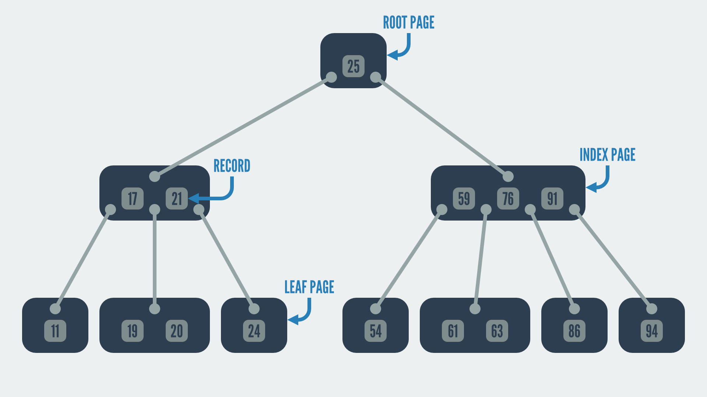

# IDA Database

## Introduction

Integers are unsigned little-endian unless otherwise specified.

Most of this information was obtained through reviewing the code of the following amazing projects:

- https://github.com/williballenthin/python-idb
- https://github.com/nlitsme/pyidbutil
- https://github.com/Vector35/idb-parser-rs
- https://github.com/aerosoul94/tilutil

## Header

| Offset | Size | Field          | Purpose                                                      |
| ------ | ---- | -------------- | ------------------------------------------------------------ |
| 0x00   | 4    | `magic`        | Should be either `IDA0`, `IDA1` or `IDA2`. `IDA0` and `IDA1` imply that the file is 32-bit, `IDA2` implies that it is 64-bit (this is important later). |
| 0x06   | 8    | `id0_offset`   | Offset to the `ID0` section from the start of the file.      |
| 0x0d   | 8    | `id1_offset`   | Offset to the `ID1` section from the start of the file.      |
| 0x1a   | 4    | `signature`    | Should be `0xaabbccdd`.                                      |
| 0x1e   | 2    | `version`      | Should be `6`.                                               |
| 0x20   | 8    | `nam_offset`   | Offset to the `NAM` section from the start of the file.      |
| 0x28   | 8    | `seg_offset`   | Offset to the `SEG` section from the start of the file.      |
| 0x30   | 8    | `til_offset`   | Offset to the `TIL` section from the start of the file.      |
| 0x38   | 4    | `id0_checksum` | CRC32 checksum of the `ID0` section.                         |
| 0x3c   | 4    | `id1_checksum` | CRC32 checksum of the `ID1` section.                         |
| 0x40   | 4    | `nam_checksum` | CRC32 checksum of the `NAM` section.                         |
| 0x44   | 4    | `seg_checksum` | CRC32 checksum of the `SEG` section.                         |
| 0x48   | 4    | `til_checksum` | CRC32 checksum of the `TIL` section.                         |
| 0x4c   | 8    | `id2_offset`   | Offset to the `ID2` section from the start of the file.      |
| 0x50   | 4    | `id2_checksum` | CRC32 checksum of the `ID2` section.                         |

## Section Header

All sections have the following header. The section contents start immediately after.

| Offset | Size | Field                | Purpose                                           |
| ------ | ---- | -------------------- | ------------------------------------------------- |
| 0x00   | 1    | `compression_method` | `0` for no compression. `2` for Zlib compression. |
| 0x01   | 8    | `section_length`     | The length of the section (before decompression). |

## `ID0`

### Introduction

`ID0` is the most complex and useful section of an IDA Database.

### Header

`page_size - 0x1c` bytes of padding follow the header.

| Offset | Size | Field             | Purpose                                        |
| ------ | ---- | ----------------- | ---------------------------------------------- |
| 0x00   | 4    | `next_free_index` | The index of the next free page.               |
| 0x04   | 2    | `page_size`       | The number of bytes occupied by a single page. |
| 0x06   | 4    | `root_page_index` | The index of the root page.                    |
| 0x0a   | 4    | `record_count`    | The number of non-dead records.                |
| 0x0e   | 4    | `page_count`      | The number of non-dead pages.                  |
| 0x13   | 9    | `magic`           | Should be `B-tree v2`.                         |

### B-Tree

#### Introduction

The contents of `ID0` are laid out as a B-tree. A B-tree is similar to a binary search tree except that each page (collection of records) may have more than two. Each record has a key (shown in the diagram below) and a value.



#### Page

Every page starts with the following header:

| Offset | Size | Field              | Purpose                                                      |
| ------ | ---- | ------------------ | ------------------------------------------------------------ |
| 0x00   | 4    | `first_page_index` | The index of the first (left-most) child page. If this is `0` then the page is a leaf page, otherwise it is an index page. |
| 0x04   | 2    | `count`            | The number of records in the page.                           |

Following this there is a `count` length array of record meta structures.

#### Index Record Meta

| Offset | Size | Field           | Purpose                                                 |
| ------ | ---- | --------------- | ------------------------------------------------------- |
| 0x00   | 4    | `page_index`    | The index of the child page to the right of the record. |
| 0x04   | 2    | `record_offset` | The offset from the start of the page to the record.    |

#### Leaf Record Meta

| Offset | Size | Field           | Purpose                                                      |
| ------ | ---- | --------------- | ------------------------------------------------------------ |
| 0x00   | 4    | `indent`        | The number of bytes to prepend to this record's key from the start of the last (next-left) record's key. |
| 0x04   | 2    | `record_offset` | The offset from the start of the page to the record.         |

#### Record

Each field follows immediately from the last.

| Size           | Field          | Purpose                                            |
| -------------- | -------------- | -------------------------------------------------- |
| 2              | `key_length`   | The length of the record's key (without `indent`). |
| `key_length`   | `key`          | The record's key.                                  |
| 2              | `value_length` | The length of the record's value.                  |
| `value_length` | `value`        | The record's value.                                |

### Net Nodes

#### Introduction

Net nodes are IDA's method of grouping records related to something (often an address). Each net node has an integer key. It may also have a string key which can be resolved to the integer key.

The entries inside a net node are identified by a tag (single byte value) and index (4 or 8 byte value). The B-tree structure makes it efferent to find all entries with a given tag.

#### String Key

String keys can be resolved to integer keys by searching the B-tree for an entry with the key:

```plain
N<string_key>
```

The entry's value gives the integer key.